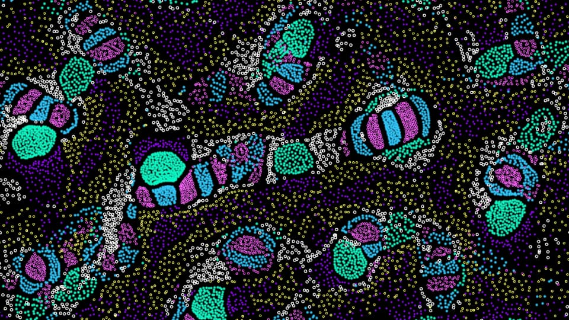

# Particle Life TSL

**言語 / Languages:** [日本語](#) | [English](README_EN.md)

Three.js WebGPU と Three.js Shading Language (TSL)を使用したパーティクルライフシミュレーションです。

## デモ

[](https://shuya-tamaru.github.io/particle-life-tsl/)

[🚀 ライブデモを見る](https://shuya-tamaru.github.io/particle-life-tsl/)

## 概要

このプロジェクトは、異なる種類のパーティクル間の引力と斥力によって生まれる複雑な動的パターンを可視化するパーティクルライフシミュレーションです。WebGPU の並列計算能力を活用し、滑らかで高性能なアニメーションを実現しています。

## 使い方

1. ブラウザで開発サーバーまたはデモサイトにアクセス
2. 画面右側の GUI パネルでパラメータを調整
3. パーティクルの動きや色、相互作用の強さを変更して様々なパターンを楽しむ

## プロジェクト構造

```
particle-life-tsl/
├── src/
│   ├── app/
│   │   └── bootstrap.ts    # メインアプリケーションロジック
│   ├── main.ts            # エントリーポイント
│   └── style.css          # スタイルシート
├── public/
│   ├── faviconLight.svg   # ファビコン
│   └── thumbnail.jpg      # サムネイル画像
├── index.html             # HTMLテンプレート
└── package.json           # プロジェクト設定
```

**作成者**: [Shuya Tamaru](https://github.com/shuya-tamaru)
